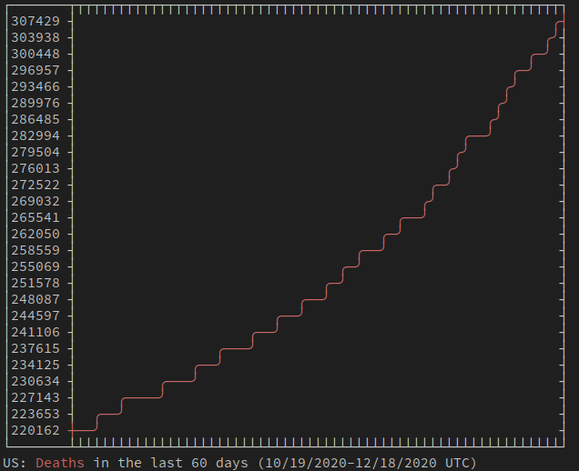
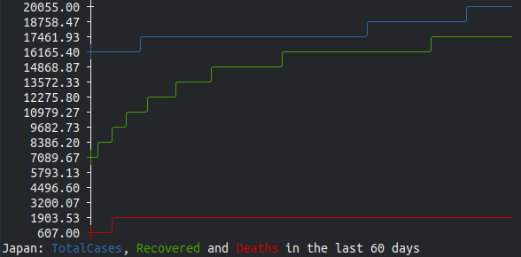

# Covid-Graph

ASCII graph data for COVID-19. A nice way to get current Coronavirus data in your terminal. Either use the live link, or set it up locally to use the cli or node server.

## Live

-   [https://covid-graph.cgsimmons.dev](https://www.covid-graph.cgsimmons.dev)
-   `curl "https://covid-graph.cgsimmons.dev/graph"`

## Local Setup

-   clone the repo: `git clone git@github.com:cgsimmons/covid-graph.git`
-   cd into directory: `cd covid-graph`
-   install node packages: `npm i`
-   run the cli: `./bin/covid-graph-cli --help`
-   run the server: `npm run start`

## ENV Variables

-   PORT: Used to select the listening port. Default 3000

## HTTP Opions

`localhost:3000/graph/help`

-   days: Number of days before the current day to start collecting data (x axis)
-   height: Number of rows to allow for y axis
-   country: Target country name or code
-   disableCases: Remove total case data from results
-   disableRecovered: Remove recovered case data from results
-   disableDeaths: emove deaths data from results

## Command Line Options

-  -d, --days <number>    number of days the chart will go back (default: 60)
-  -c, --country <name>   target country (country name, iso2, iso3, or country ID code) (default: "US")
-  -h, --height <number>  max terminal chart height (default: 25)
-  -R --no-recovered      Disable recoveries
-  -D --no-deaths         Disable deaths
-  -C --no-cases          Disable total cases
-  -B --no-box            Disable graph enclosing box
-  --help                 display help for command

## Examples

-   `curl "https://covid-graph.cgsimmons.dev/graph?disableCases=true&disableRecovered=true"`

    

-   `curl "https://covid-graph.cgsimmons.dev/graph?country=Japan&height=15"`

    

## Additional Details

This is setup to support lambda functions as a stateless service. This is accomplished via a combination of serverless-http along with netlify-lambda. The netlify.toml designates the build process and redirects required for lambda routes deployment on netlify.

## Resources

-   [disease.sh](https://github.com/disease-sh/API) - Covid data API
-   [asciichart](https://github.com/kroitor/asciichart) - ASCII chart generation
