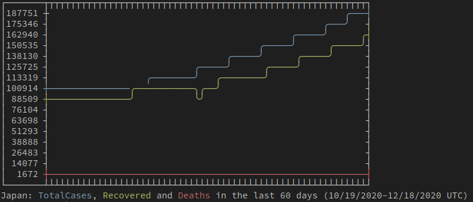

# Covid-Graph

ASCII graph data for COVID-19. A nice way to get current Coronavirus data in your terminal. Either use the live link, or set it up locally to use the cli or node server.

## Live

-   [https://covid-graph.cgsimmons.dev](https://www.covid-graph.cgsimmons.dev)
-   `curl "https://covid-graph.cgsimmons.dev/graph"`

## Local Setup

-   clone the repo: `git clone git@github.com:cgsimmons/covid-graph.git`
-   cd into directory: `cd covid-graph`
-   install node packages: `npm i`
-   run the cli: `./bin/covid-graph-cli --help`
-   run the server: `npm run start`

## ENV Variables

-   PORT: Used to select the listening port. Default 3000

## HTTP Opions

`localhost:3000/graph/help`

-   days: Number of days before the current day to start collecting data (x axis)
-   height: Number of rows to allow for y axis
-   country: Target country name or code
-   disableCases: Remove total case data from results
-   disableRecovered: Remove recovered case data from results
-   disableDeaths: emove deaths data from results

## Examples

-   `curl "https://covid-graph.cgsimmons.dev/graph?disableCases=true&disableRecovered=true"`

    

-   `curl "https://covid-graph.cgsimmons.dev/graph?country=Japan&height=15"`

    

## Additional Details

This setup supports lambda functions as a stateless service. This is accomplished via a combination of serverless-http along with netlify-lambda. The netlify.toml designates the build process and redirects required for lambda routes deployment on netlify. The libraries allow constructing a standard node app, but then wraps the routes to be used for lambda. Win-Win.

## Resources

-   [disease.sh](https://github.com/disease-sh/API) - Covid data API
-   [asciichart](https://github.com/kroitor/asciichart) - ASCII chart generation
